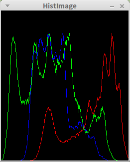

 Julia-OpenCV binding prototype
=====================

**NOTE:**
This project currently is a **minimal prototype** of Julia-OpenCV binding. It is under development.
It is **not** ready for common use and **only work** for Linux now.

Introduction
------------

This OpenCV-Julia binding is try to port OpenCV API to Julia. It use the "**OpenCV way**". The "OpenCV way" means the wrapping will only use the language itself, without 3rd party tools. Like official OpenCV-Python and OpenCV-Julia did.

This binding take OpenCV-Python and OpenCV-Java as reference. It will more like OpenCV-Java. For example, map datatype manually, use Python generation tool to wrap functions.

Goal
----

The goal of this project is provide an easy to use and Julia style API. Let user could use OpenCV functions in Julia **without recompile OpenCV with specific compiler**. That's means you can use OpenCV in Julia with offcial binary package, as well as custom build OpenCV.

**Update Jan 17th, 2015**
Restart the project

~~How to use it~~
---------
~~Run Makefile, compile cv2.h and cv2.cpp to a shared library. Change the image path in test/read.jl. Run "julia read.jl".~~

**Note**: Rewriting the build system with CMake. Make the binding could merge to OpenCV CMake build system possible.

Minimal Example -- Calculate histogram
-------------------

The code of calculating histogram that use OpenCV Julia binding is like this:

```
include("../src/OpenCV.jl")

img = cv2.imread("/home/sun/workspace/Lena.jpg")

# split image by each channel
images = cv2.split(img)

# make an empty image to draw histogram
histImage = cv2.zeros(300, 256, cv2.matType(img))

# prepare the x coordinate of each bin
bins = reshape(1:256, 256)

#Three color of BGR
color = [ (255,0,0),(0,255,0),(0,0,255) ]

# draw the histogram for each channel by cv.polylines
for i = 1:3
    # calculate histogram for each channel
    hist = cv2.calcHist([images[i]], [0], [256], [0.0, 255.0])
    # an custom function, normarlize the hist value to 0-255
    hist = cv2.normarlizeT(hist)
    # make the histogram draw in image from down to top
    for j = 1:length(hist)
        hist[j] = 300 - hist[j]
    end
    # stack two array by column, I don't know whether there has
    # similar function in Julia
    pts = cv2.columnStack(bins, hist)
    # draw each hist, represent to a polyline
    cv2.polylines(histImage, pts, false, color[i])
end

cv2.imshow("HistImage", histImage)
cv2.waitKey(0)
```

I am sure you can understand the code by reading comments and codes. Here is the
output that generated in Julia by the binding:



More information, please see `/doc/test_descritopns`(Actually, not much for now)

TODO
------

- Windows support(In progress)
- CMake support
- Basic datatype mapping
- Generation tool

Contact
--------
Any comments or suggestion are highly appreciated! Please send these to [Julia-dev mailist](https://groups.google.com/forum/#!forum/julia-dev), I will see that. 
