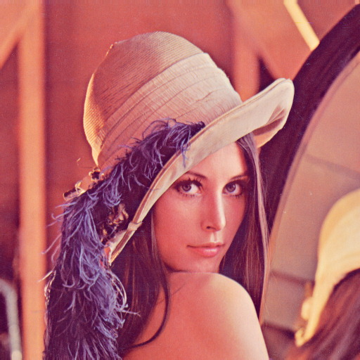
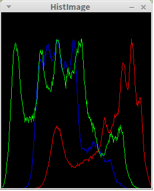

# OpenCV Julia introduction

## Introduction

The OpenCV Julia binding is under development. Now I am focus on wrap OpenCV
data types and APIs manually. 

The current roadmap is(It may have changes during the development):

- Wrap some basic data types and APIs of OpenCV, find and verify the wrap
patterm(Almost done).
- Reconsturct the wrapper that was wrote in stage 1, try to find a patter that could
  wrap OpenCV automatically through an generation tool.
- Write an generation tool, the generation tool take the output of hearder
  parser in Python binding in OpenCV official repo as input.
- Test.

## How to install
Due to the binding is still under the initial development, the installation step may not
graceful. I will give a easy and graceful installation way for Windows and Linux after I wrote the generation file.

For now, the binding only wrote and tested on Linux 64 bits platform. No
guarantee for other platform.

## Exist samples

I have wrote some samples for testing the API that wrapped manually: Calculate
and draw the histogram for a RGB image, blur an image.

Now I will demonstrate how to use the binding to do those things.

There is a test image:



### Blur an image
Blur an image is simple, just read an image and call cv::blur.

Here is the code in Julia:

```
include("../src/OpenCV.jl")

img = cv2.imread("/home/sun/workspace/Lena.jpg")

result = cv2.blur(img, (5, 5))

cv2.imshow("HistImage", img)
cv2.imshow("Blur", result)

cv2.waitKey(0)
```

Simply, isn't it?

No suprise, the output is shown below:


### Calculate histogram

The code of calculating histogram that use OpenCV Julia binding is like this:

```
include("../src/OpenCV.jl")

img = cv2.imread("/home/sun/workspace/Lena.jpg")

# split image by each channel
images = cv2.split(img)

# make an empty image to draw histogram
histImage = cv2.zeros(300, 256, cv2.matType(img))

# prepare the x coordinate of each bin
bins = reshape(1:256, 256)

#Three color of BGR
color = [ (255,0,0),(0,255,0),(0,0,255) ]

# draw the histogram for each channel by cv.polylines
for i = 1:3
    # calculate histogram for each channel
    hist = cv2.calcHist([images[i]], [0], [256], [0.0, 255.0])
    # an custom function, normarlize the hist value to 0-255
    hist = cv2.normarlizeT(hist)
    # make the histogram draw in image from down to top
    for j = 1:length(hist)
        hist[j] = 300 - hist[j]
    end
    # stack two array by column, I don't know whether there has
    # similar function in Julia
    pts = cv2.columnStack(bins, hist)
    # draw each hist, represent to a polyline
    cv2.polylines(histImage, pts, false, color[i])
end
         
cv2.imshow("HistImage", histImage)
cv2.waitKey(0)
```

I am sure you can understand the code by reading comments and codes. Here is the
output that generated in Julia by the binding:



For reference, here is the the code write in Python with official OpenCV Python binding:

```
#coding=utf-8
import cv2
import numpy as np

img = cv2.imread('/home/sun/workspace/Lena.jpg')

# empty image for draw hist
h = np.zeros((256,256,3))

# the x coordinate for each hist bin
bins = np.arange(256).reshape(256,1)

# the color using for draw BGR hist
color = [ (255,0,0),(0,255,0),(0,0,255) ]

# draw the hist for each channel
for ch, col in enumerate(color):    
    originHist = cv2.calcHist([img],[ch],None,[256],[0,256])    
    cv2.normalize(originHist, originHist,0,255*0.9,cv2.NORM_MINMAX)    
    hist=np.int32(np.around(originHist))    
    pts = np.column_stack((bins,hist))    
    cv2.polylines(h,[pts],False,col)    
         
h=np.flipud(h)    
         
cv2.imshow('colorhist',h)    
cv2.waitKey(0) 
```

Output:


